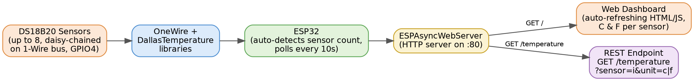

# ESP32 IoT Temperature Sensing Dashboard

A multi-sensor temperature monitoring system built on the ESP32, supporting up to 8 DS18B20 sensors on a single 1-Wire bus. Sensor readings are served over Wi-Fi through a live, self-refreshing web dashboard and a lightweight REST-style API — no external cloud service or app required.

Originally built to monitor rack/room temperatures across multiple points in a data center environment.

## System Architecture



## Features

- **Multi-sensor support** — automatically detects up to 8 DS18B20 sensors daisy-chained on a single OneWire bus (GPIO 4 by default); no manual sensor count configuration needed.
- **Live web dashboard** — a built-in HTML/JS dashboard served directly from the ESP32, auto-refreshing every 10 seconds with no page reload.
- **Dual units** — every sensor reading is available in both Celsius and Fahrenheit.
- **REST-style API** — `GET /temperature?sensor=<index>&unit=c|f` returns a single sensor's reading as plain text, making it easy to poll from other tools, scripts, or dashboards (e.g. Grafana, a cron job, a Slack bot).
- **Asynchronous server** — built on `ESPAsyncWebServer`, so the dashboard stays responsive without blocking sensor polling.
- **Graceful disconnect handling** — a disconnected/faulty sensor reports `--` instead of a stale or garbage reading.

## Hardware

| Component | Notes |
|---|---|
| ESP32 dev board | Any variant with Wi-Fi (this project requires ESP32; it will not compile for ESP8266 or AVR boards) |
| DS18B20 temperature sensor(s) | Up to 8, wired in parallel on the same 1-Wire data line |
| 4.7kΩ resistor | Pull-up resistor between the data line and 3.3V — required for the 1-Wire bus to function reliably |

**Wiring:** All DS18B20 sensors share the same three lines — VCC (3.3V), GND, and Data (GPIO 4 by default, configurable via `ONE_WIRE_BUS`). Each sensor has a unique factory-programmed address, so multiple sensors can sit on the same bus without conflicting.

## Software Requirements

- [Arduino IDE](https://www.arduino.cc/en/software) with ESP32 board support installed
- Libraries (install via Library Manager):
  - `ESPAsyncWebServer`
  - `AsyncTCP` (dependency of `ESPAsyncWebServer` on ESP32)
  - `OneWire`
  - `DallasTemperature`

## Setup

1. Wire the DS18B20 sensor(s) as described above.
2. Open `esp32_temp_sense_2_plot/esp32_temp_sense_2_plot.ino` in the Arduino IDE.
3. Set your Wi-Fi credentials:
   ```cpp
   const char* ssid = "your-network-name";
   const char* password = "your-network-password";
   ```
   > **Note:** Don't commit real credentials to a public repo. See "Future Work" below for a cleaner approach.
4. Select your ESP32 board and port, then upload.
5. Open the Serial Monitor (115200 baud) — once connected, it prints the device's local IP address.
6. Visit that IP address in a browser to view the live dashboard.

## API Reference

| Endpoint | Method | Description |
|---|---|---|
| `/` | GET | Serves the full HTML dashboard, auto-populated with all detected sensors. |
| `/temperature?sensor=<i>&unit=<c\|f>` | GET | Returns a single sensor's current reading as plain text. `sensor` is a zero-indexed sensor number; `unit` is `c` or `f`. |

## Project Structure

```
IOT-temp-sense/
├── README.md
├── LICENSE
├── .gitignore
├── assets/
│   └── architecture-diagram.png
└── esp32_temp_sense_2_plot/
    └── esp32_temp_sense_2_plot.ino
```

## Future Work

- Move Wi-Fi credentials out of source into a separate, git-ignored `secrets.h` file.
- Add configurable threshold-based alerting (e.g. webhook/email notification when a sensor exceeds a safe temperature).
- Persist historical readings (e.g. to SPIFFS/SD or an external time-series database) instead of only showing live values.
- Add authentication to the dashboard/API before deploying outside a trusted local network.
